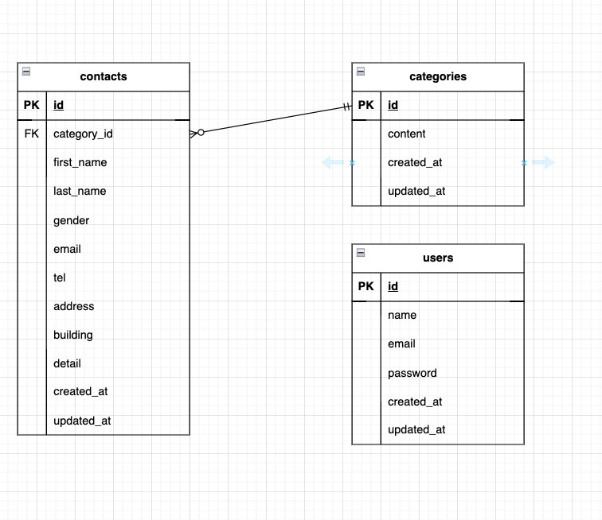

# FashionablyLate

## 環境構築

### Dockerビルド手順
1. `git clone git@github.com:mabe4242/FashionablyLate.git`
2. `docker-compose up -d --build`

※ MySQLは、OSによって起動しない場合があるので、それぞれのPCに合わせて `docker-compose.yml` ファイルを編集してください。

### Laravel環境構築手順
1. `docker-compose exec php bash`
2. `composer install`
3. `.env.example` ファイルから `.env` を作成し、環境変数を編集
4. `php artisan key:generate`
5. `php artisan migrate`
6. `php artisan db:seed`

## 使用技術（実行環境）
- PHP 8.0
- Laravel 10.0
- MySQL 8.0

## ER図
  

## ダミーデータの作成日につきまして
検索機能の動作確認のため、ダミーデータの日付の指定はdb:seedした日から1週間前までの期間で35個作成いたします。  
例えば、7/14(月)にdb:seedをされた場合、7/8〜7/14までの期間にお問い合わせのダミーデータが作成されます。  
検索機能の動作をご確認いただく際は、恐れ入りますが、指定の期間内の日付をご入力いただきますようお願いいたします。

## URL
- 開発環境： [http://localhost/](http://localhost/)
- phpMyAdmin： [http://localhost:8080/](http://localhost:8080/)